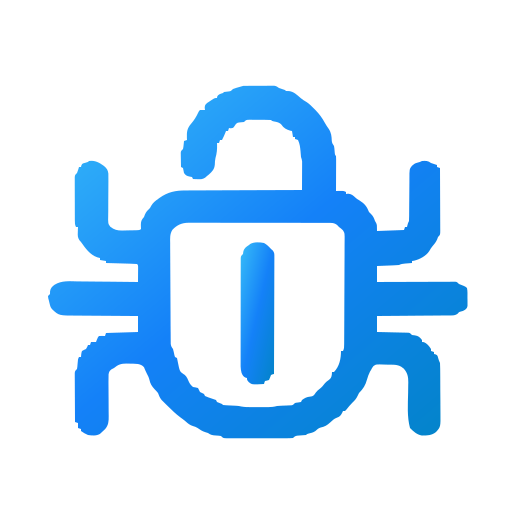

# BlueBug

<p align="center">
  
</p>

<h3 align="center">Digital Engineering &amp; Software Consultancy</h3>

<p align="center">
  High-performance custom software, modern web platforms, mobile apps, and AI/ML systems built for startups and fast-moving teams.
</p>

---

## ⚡ Tech Stack

### Frontend (`bluebug-frontend`)
- **Framework**: Next.js 16 (App Router, Turbopack)
- **Language**: TypeScript
- **Styling**: Vanilla CSS Design System with dark glassmorphic tokens
- **Motion & UI**: Framer Motion, Lucide React icons
- **Features**:
  - Cinematic site loading intro animation (emblem pop, 360° spin, and dynamic navbar docking)
  - Bento project grid with category filtering
  - SSR & statically optimized case study pages
  - High-converting lead capture form with backend API integration
  - 100% exact vector geometry SVG branding and multi-size favicon suite

### Backend (`bluebug-backend`)
- **Framework**: Django 6.1 & Django REST Framework (DRF)
- **Database**: PostgreSQL (Production) / SQLite (Local development)
- **Admin**: Django Unfold modern administrative dashboard
- **Security & Reliability**:
  - Sentry SDK error tracking & performance monitoring
  - CORS headers configured for production domains
  - WhiteNoise for optimized static assets serving
  - Django Environ for 12-factor environment management

---

## 🚀 Getting Started

### Prerequisites
- Node.js 18+ & npm
- Python 3.12+
- Git

---

### 1. Frontend Setup

```bash
cd bluebug-frontend
npm install
npm run dev
```

The frontend will run at **http://localhost:3000**.

To build for production:
```bash
npm run build
npm start
```

---

### 2. Backend Setup

```bash
cd bluebug-backend

# Create & activate virtual environment
python -m venv venv
# On Windows:
.\venv\Scripts\activate
# On macOS/Linux:
source venv/bin/activate

# Install dependencies
pip install -r requirements.txt

# Run migrations
python manage.py migrate

# Seed initial projects and services
python seed.py

# Start development server
python manage.py runserver 8000
```

The backend API runs at **http://localhost:8000/api/**.
Django Admin is available at **http://localhost:8000/admin/**.

---

## 📂 Project Structure

```
BlueBug site/
├── bluebug-frontend/         # Next.js App Router frontend
│   ├── app/                  # Pages, routes, layouts, and metadata
│   ├── components/           # UI and layout components (Navbar, Footer, SiteLoader)
│   ├── lib/                  # Centralized config, API client, types, icons
│   └── public/               # Static assets (logo.svg, logo.png, favicons)
├── bluebug-backend/          # Django REST Framework backend
│   ├── apps/
│   │   ├── core/             # Base models and utilities
│   │   ├── projects/         # Portfolio & case study APIs
│   │   ├── services/         # Services & capabilities APIs
│   │   └── leads/            # Contact inquiries & CRM lead management
│   └── config/               # Django settings, URLs, WSGI/ASGI
└── BlueBug-Site-Build-Guideline.md  # Comprehensive architecture & build guide
```

---

## 📄 License

This project is licensed under the MIT License - see the [LICENSE](LICENSE) file for details.